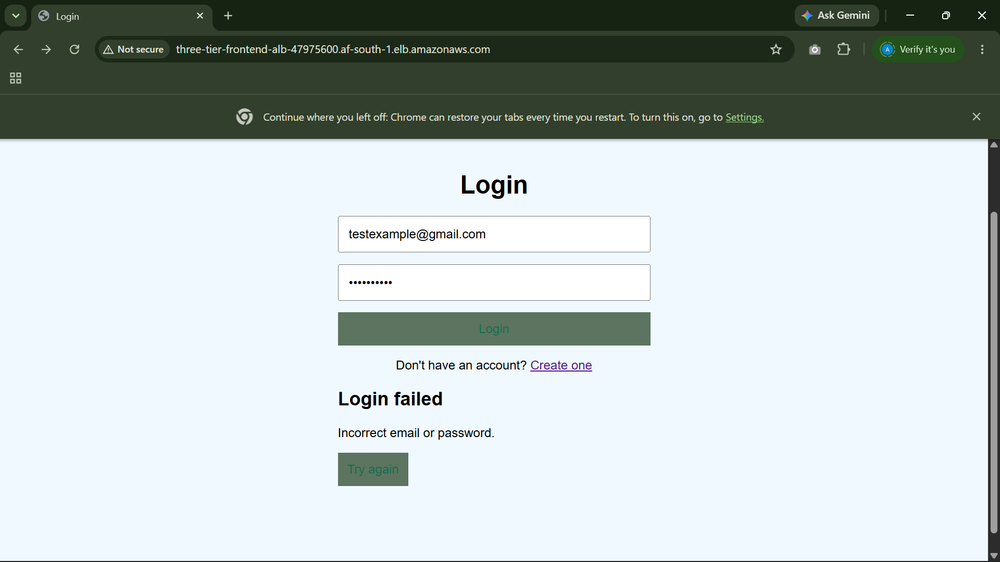

# Welcome to the Three-Tier Application project.

**Problem:**

A business in Africa needed to move its application online and provide customers with a responsive and reliable login and signup experience.

**Solution:**

The project uses a three-tier architecture consisting of a **frontend, backend, and database**, deployed using cloud infrastructure.

This README documents the **application development and infrastructure setup process**, allowing you to follow the steps and reproduce the project.

## Table of Contents

* [App Development](#app-development)

  * [1. Backend Application](#1-backend-application)
  * [2. Frontend Application](#2-frontend-application)

* [Infrastructure](#infrastructure)

  * [Requirements](#requirements)
  * [Infrastructure Modules](#infrastructure-modules)

    * [1. Compute](#1-compute)

      * [1.1 Application Load Balancer (`alb.tf`)](#11-application-load-balancer-albtf)
      * [1.2 Frontend Launch Template (`launch-template.tf`)](#12-frontend-launch-template-launch-templatetf)
      * [1.3 Auto Scaling Group (`asg.tf`)](#13-auto-scaling-group-asgtf)
      * [1.4 Backend EC2](#14-backend-ec2)
    * [2. Network](#2-network)

      * [2.1 VPC Network](#21-vpc-network)
      * [2.2 Frontend Public Routing](#22-frontend-public-routing)
      * [2.3 Backend Private Routing](#23-backend-private-routing)
      * [2.4 Database Subnets](#24-database-subnets)
    * [3. Security](#3-security)

      * [3.1 ALB Security Group](#31-alb-security-group)
      * [3.2 Frontend Security Group](#32-frontend-security-group)
      * [3.3 Backend Security Group](#33-backend-security-group)
      * [3.4 Database Security Group](#34-database-security-group)
    * [4. Database](#4-database)
    * [5. Storage](#5-storage)
    * [6. IAM](#6-iam)

      * [6.1 Frontend EC2](#61-frontend-ec2)
      * [6.2 Backend EC2](#62-backend-ec2)
      * [6.3 GitHub Actions](#63-github-actions)
    * [`main.tf` & `provider.tf`](#maintf--providertf)

* [Deployment](#deployment)

  * [1. Provision the Infrastructure](#1-provision-the-infrastructure)
  * [2. Configure GitHub Actions](#2-configure-github-actions)
  * [3. Trigger the Deployment](#3-trigger-the-deployment)
  * [4. Access the Application](#4-access-the-application)
  * [5. For Troubleshooting or Administration](#5-for-troubleshooting-or-administration)

    * [Updating the Application](#updating-the-application)
  * [6. Destroy the Infrastructure](#6-destroy-the-infrastructure)

---

## App Development

The application was kept simple to support the project's primary focus: deploying a three-tier application using cloud infrastructure.

### 1. Backend Application

The backend was built using Node.js and TypeScript with Express.

The application provides authentication endpoints for:

* User signup
* User login

The backend is organized into:

* Routes
* Controllers
* Database connection


#### 1.1 Dependencies

The backend dependencies are defined in `package.json`.

To install the project dependencies, run:

```bash
npm install
```

---


### 2. Frontend Application

The frontend was built using:

* **HTML** — page structure and rendering
* **CSS** — styling
* **JavaScript** — application logic and communication with the backend

The frontend communicates with the backend using HTTP requests to the authentication endpoints.


## Infrastructure

The infrastructure is the core of the solution, designed around the application's needs to deploy and run it in the cloud.

### Requirements

* Users should be able to access the frontend from the internet.
* The frontend should communicate with the backend.
* The backend should communicate with the database.
* The backend and database should not be directly accessible from the internet.
* The frontend should be highly available.
* The application should provide a responsive experience for users.
* The infrastructure should be reproducible using Terraform.

### Infrastructure Modules

Terraform supports modular infrastructure, allowing resources to be separated by responsibility and reused where needed.

---

### 1. Compute

#### 1.1 Application Load Balancer (`alb.tf`)

With multiple frontend EC2 servers, we needed a single point of entry for users. We therefore deployed an Application Load Balancer in the public subnets to receive traffic from the internet and distribute it across the frontend servers.

The ALB uses a **target group** to define and track the frontend instances that can receive traffic, while a **listener** receives incoming requests and forwards them to the target group.

* **Target group** — tracks the frontend instances that can receive traffic.
* **Listener** — receives incoming requests and forwards them to the target group.

#### 1.2 Frontend Launch Template (`launch-template.tf`)

Because the frontend servers use the same configuration, we created a launch template containing their common configuration. This allows new frontend instances to be created consistently.

#### 1.3 Auto Scaling Group (`asg.tf`)

We used an Auto Scaling Group to manage the frontend instances across two Availability Zones, providing the required frontend availability and allowing instances to be replaced when needed.

#### 1.4 Backend EC2

The backend was deployed on a single EC2 instance because the application only required a simple backend server for this project.

---

### 2. Network

#### 2.1 VPC Network

We created a VPC with the CIDR block `10.0.0.0/16` to provide the network for the application.

#### 2.2 Frontend Public Routing

The frontend needed to be accessible from the internet, so we created two public subnets in different Availability Zones.

We attached an **Internet Gateway** to the VPC to provide internet connectivity.

We then created a route table with a default route to the Internet Gateway:

```text
0.0.0.0/0 → Internet Gateway
```

The route table was associated with both frontend public subnets, making them public subnets.

#### 2.3 Backend Private Routing

The backend needed to remain private, so we created one private subnet in a single Availability Zone.

Because the backend still needed outbound internet access, we created a **NAT Gateway** in a public subnet. The NAT Gateway uses an **Elastic IP** to provide a stable public IP for outbound traffic.

We then created a private route table with a default route to the NAT Gateway:

```text
0.0.0.0/0 → NAT Gateway
```

The route table was associated with the backend private subnet.

This allows the backend to initiate outbound connections without being directly reachable from the internet.

#### 2.4 Database Subnets

The database also needed to remain private. We therefore created two private subnets in different Availability Zones.

These subnets were used to create an **RDS DB subnet group**, allowing the database to be deployed within the VPC across the required Availability Zones.

---

### 3. Security

We created four security groups to control traffic between the components of the application.

#### 3.1 ALB Security Group

To make the application accessible from the internet, the ALB allows inbound HTTP traffic from the internet and allows outbound traffic.

#### 3.2 Frontend Security Group

The frontend EC2 instances allow inbound HTTP traffic only from the ALB, ensuring users reach the frontend through the load balancer.

SSH access was also allowed from **EC2 Instance Connect** for administration.

#### 3.3 Backend Security Group

The backend allows inbound traffic on port `8080` only from the frontend security group.

This keeps the backend inaccessible directly from the internet while allowing the frontend to communicate with it.

#### 3.4 Database Security Group

The database allows inbound PostgreSQL traffic on port `5432` only from the backend security group.

This ensures that only the backend can communicate with the database.

---

### 4. Database

We used **Amazon RDS PostgreSQL** to provide the application's database.

The database was configured as a private RDS instance using the DB subnet group and security group created earlier. The database credentials are managed through **AWS Secrets Manager** rather than being stored directly in the application configuration.

---

### 5. Storage

We created a private **S3 bucket** to store the application artifacts for both the frontend and backend.

The EC2 instances retrieve these artifacts during startup using their **user data** scripts, allowing the application servers to be provisioned with the required application files automatically.

---

### 6. IAM

We created IAM identities and permissions for the services that needed access to AWS resources.

#### 6.1 Frontend EC2

The frontend servers needed to retrieve the frontend application files from S3. We therefore created an IAM role with permission to read the S3 bucket and an instance profile that allows the EC2 instances to use the role.

#### 6.2 Backend EC2

The backend needed to retrieve its application files from S3 and access the database credentials stored in Secrets Manager. We therefore created an IAM role with permissions for these resources and attached it to the backend EC2 through an instance profile.

The backend role also uses **AmazonSSMManagedInstanceCore** to allow administration through AWS Systems Manager Session Manager.

#### 6.3 GitHub Actions

We needed GitHub Actions to automatically upload the frontend and backend application files to S3 whenever changes were pushed. The workflow therefore needed AWS credentials with permission to upload the files to the S3 bucket, which we provided through an IAM user.

The workflow is defined in `.github/workflows/deploy.yaml`.


### main.tf & provider.tf

The `main.tf` file is used to configure and build the infrastructure modules that make up the project.

The `provider.tf` file configures Terraform and specifies the AWS provider and region used to provision the infrastructure.

The AWS region was set to `af-south-1` to satisfy the business requirement of deploying the application in Africa while also providing low-latency access for users in the region.

---

## Deployment

### 1. Provision the Infrastructure

From the `Infrastructure` directory, initialize Terraform and provision the infrastructure. Also ensure you are connected to the AWS CLI:

```bash
terraform init
terraform fmt
terraform validate
terraform plan
terraform apply
```

Wait for Terraform to complete successfully.

### 2. Configure GitHub Actions

Create the required GitHub repository secrets using the AWS credentials for the IAM user created for GitHub Actions.

The secret names must match the names referenced in `.github/workflows/deploy.yaml`.

### 3. Trigger the Deployment

Push the application code to the GitHub repository:

```bash
git add .
git commit -m "Deploy application"
git push
```

Open the **Actions** tab in GitHub and verify that the deployment workflow completes successfully.

The workflow uploads the frontend and backend application files to their respective locations in the S3 artifact bucket.

### 4. Access the Application

After the workflow succeeds, retrieve the **DNS name of the Application Load Balancer**.

Open the address in a browser using **HTTP**, not HTTPS:

```text
http://<alb-dns-name>
```

Check **Target Groups** to ensure both frontend instances are healthy and receiving traffic.

The frontend application should load.



Test the application by:

* Creating a new account using **Sign Up**
* Logging in using **Login**
* Confirming that the requests successfully reach the backend and database

### 5. For troubleshooting or administration

* **Frontend EC2:** Use **EC2 Instance Connect**. The frontend security group allows SSH access through the configured EC2 Instance Connect prefix list.
* **Backend EC2:** Use **AWS Systems Manager Session Manager**. The backend IAM role includes the permissions required for SSM access.

#### Updating the Application

The deployment setup is intentionally simple: the EC2 instances retrieve the application files only when they start.

If frontend or backend application files are changed and pushed to GitHub, the workflow will update the files in S3, but the existing EC2 instances will not automatically reload the new files.

For frontend changes:

1. Push the changes to GitHub and wait for the workflow to complete.
2. Terminate the existing frontend EC2 instances.
3. The Auto Scaling Group will automatically launch replacement instances.
4. The new instances will retrieve the updated files from S3 during startup.

For backend changes:

1. Push the changes to GitHub and wait for the workflow to complete.
2. Terminate the existing backend EC2 instance.
3. Run:

```bash
terraform apply
```

4. Terraform will provision a replacement backend instance.
5. The new instance will retrieve the updated backend files from S3 during startup.

### 6. Destroy the Infrastructure

To avoid unnecessary AWS costs after completing the project, destroy the infrastructure when it is no longer needed.

Before destroying the infrastructure, remove the GitHub Actions AWS credentials.

1. Go to the GitHub repository **Settings → Secrets and variables → Actions**.
2. Delete:

   * `AWS_ACCESS_KEY_ID`
   * `AWS_SECRET_ACCESS_KEY`

Next, remove the access keys from the GitHub Actions IAM user.

1. Open **AWS IAM → Users**.
2. Select the `three-tier-github-deploy` user.
3. Open **Security credentials**.
4. Under **Access keys**, delete the access key(s).

Finally, destroy the infrastructure:

```bash
terraform destroy
```

Terraform will then remove the IAM user and its associated resources managed by Terraform.

> **Important:** Remove the GitHub secrets and IAM access keys before running `terraform destroy`. The GitHub Actions deployment workflow will no longer be able to deploy after the credentials have been removed.
